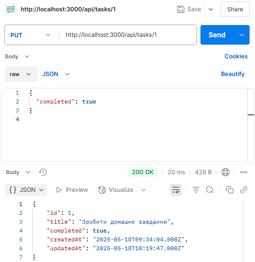
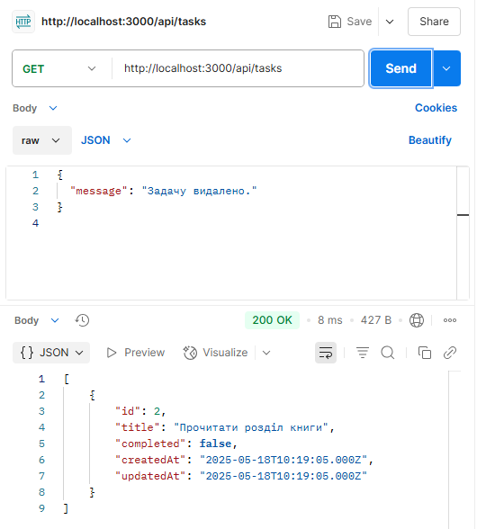
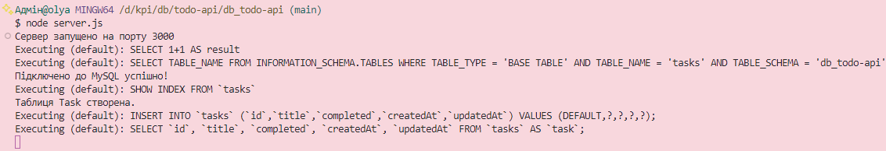

# Реалізація RESTful сервісу на JavaScript
**Мета:** розробка базового RESTful веб-сервісу для управління списком задач з використанням мови програмування JavaScript. Проєкт демонструє практичне застосування баз даних і роботу з ними, реалізацію CRUD-операцій, побудову API-сервісу.

## Зміст доповіді
1. [Використані технології](#використані-технології)
2. [Опис структури проєкту](#опис-структури-проєкту)
4. [Тестування API](#тестування-api)
5. [Скріншоти роботи](#скріншоти-роботи)
6. [Висновки](#висновки)

## Використані технології
- **Node.js** - середовище виконання JavaScript;
- **Express.js** - створення маршрутизатора;
- **MySQL** - база даних;
- **Postman** - тестування API;
- **Sequelize** - робота з MySQL через JavaScript;

## Опис структури проєкту
1. **config/database.js** - налаштування й ініціалізація підключення до бази даних MySQL через Sequelize.
``` javascript
module.exports = {
  HOST: "localhost",
  USER: "root",
  PASSWORD: "",
  DB: "db_todo-api",
  dialect: "mysql",
  pool: {
    max: 5,
    min: 0,
    acquire: 30000,
    idle: 10000
  }
};
```

2. **models/task.model.js** - опис моделі таблиці tasks у базі даних.
``` javascript
module.exports = (sequelize, DataTypes) => {
  const Task = sequelize.define("task", {
    title: {
      type: DataTypes.STRING,
      allowNull: false
    },
    completed: {
      type: DataTypes.BOOLEAN,
      defaultValue: false
    }
  });

  return Task;
};
```

3. **models/index.js** - центральний модуль для імпорту й об'днання моделей.
``` javascript
const dbConfig = require("../config/db.config.js");
const { Sequelize, DataTypes } = require("sequelize");

const sequelize = new Sequelize(dbConfig.DB, dbConfig.USER, dbConfig.PASSWORD, {
  host: dbConfig.HOST,
  dialect: dbConfig.dialect,
  pool: dbConfig.pool
});

const db = {};

db.Sequelize = Sequelize;
db.sequelize = sequelize;

db.task = require("./task.model.js")(sequelize, DataTypes);

module.exports = db;
```

4. **server.js** - основний файл запуску сервера.
``` javascript
const express = require("express");
const cors = require("cors");
const app = express();

app.use(cors());
app.use(express.json());
app.use(express.urlencoded({ extended: true }));

// Підключення до бази через Sequelize
const db = require("./models");

db.sequelize.authenticate()
  .then(() => {
    console.log("Підключено до MySQL успішно!");
  })
  .catch(err => {
    console.error("Помилка підключення:", err);
  });

// Синхронізація моделі Task
db.sequelize.sync()
  .then(() => {
    console.log("Таблиця Task створена.");
  })
  .catch(err => {
    console.error("Помилка синхронізації:", err);
  });

// Початковий маршрут
app.get("/", (req, res) => {
  res.json({ message: "Успіхів з TODO API!" });
});

const taskRoutes = require("./routes/task.routes.js");
app.use("/api/tasks", taskRoutes);

// Запуск сервера
const PORT = process.env.PORT || 3000;
app.listen(PORT, () => {
  console.log(`Сервер запущено на порту ${PORT}`);
});
```

5. **routes/task.routes.js** - визначення HTTP-маршрутів для роботи із задачами.
``` javascript
const express = require("express");
const router = express.Router();
const tasks = require("../controllers/task.controller.js");

router.post("/", tasks.create);         // Створити задачу
router.get("/", tasks.findAll);         // Отримати всі задачі
router.put("/:id", tasks.update);       // Оновити задачу за id
router.delete("/:id", tasks.delete);    // Видалити задачу за id

module.exports = router;
```

6. **controllers/task.controller.js** - обробка логіки для задач окремо від маршрутизації.
``` javascript
const db = require("../models");
const Task = db.task;

// Створити нову задачу
exports.create = async (req, res) => {
  try {
    const { title, completed } = req.body;
    if (!title) {
      return res.status(400).json({ message: "Поле 'title' обов'язкове!" });
    }

    const task = await Task.create({ title, completed });
    res.status(201).json(task);
  } catch (error) {
    res.status(500).json({ message: error.message });
  }
};

// Отримати всі задачі
exports.findAll = async (req, res) => {
  try {
    const tasks = await Task.findAll();
    res.json(tasks);
  } catch (error) {
    res.status(500).json({ message: error.message });
  }
};

// Оновити задачу за ID
exports.update = async (req, res) => {
  try {
    const id = req.params.id;
    const [updated] = await Task.update(req.body, {
      where: { id: id }
    });

    if (updated) {
      const updatedTask = await Task.findByPk(id);
      res.json(updatedTask);
    } else {
      res.status(404).json({ message: `Задачу з id=${id} не знайдено.` });
    }
  } catch (error) {
    res.status(500).json({ message: error.message });
  }
};

// Видалити задачу за ID
exports.delete = async (req, res) => {
  try {
    const id = req.params.id;
    const deleted = await Task.destroy({
      where: { id: id }
    });

    if (deleted) {
      res.json({ message: "Задачу видалено." });
    } else {
      res.status(404).json({ message: `Задачу з id=${id} не знайдено.` });
    }
  } catch (error) {
    res.status(500).json({ message: error.message });
  }
};
```

## Тестування API
1. **GET**


2. **POST**


3. **PUT**



4. **DELETE**


5. **Отримана база даних**



6. **Обробка помилок**


## Скріншоти роботи




## Висновки
У ході виконання цієї роботи було розроблено **RESTful API сервіс** для управління списком задач з використанням технологій **Node.js**, **Express.js**, **Sequelize**, **MySQL**, **Postman**. Успішність проєкту можна оцінити за **отриманими результатами**:
- Встановлено й налаштовано сервер на базі Express.
- Забезпечено обробку HTTP-запитів.
- Використано Sequelize для ефективної взаємодії з базою даних MySQL.
- Реалізовано повний набір CRUD-операцій.
- Впроваджено розділення коду за принципом MVC для покращення підтримки й розширюваності функціоналу.
- Встановлено коректне підключення до БД.
- Реалізовано синхронізацію структури табллиць.
- Перевірено роботу API за допомогою інструменту Postman.

Проєкт може бути використаний як основа для подальшої розробки складніших застосунків, оскільки має опис **основних принципів побудови RESTful сервісів**, **організації роботи** з базами даних, а також створення **серверної логіки**.

##

